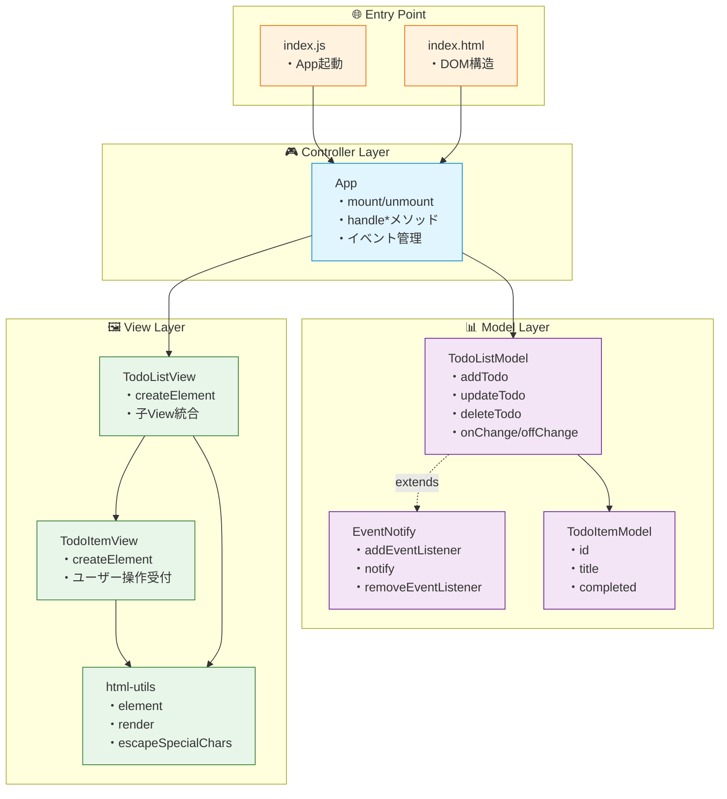
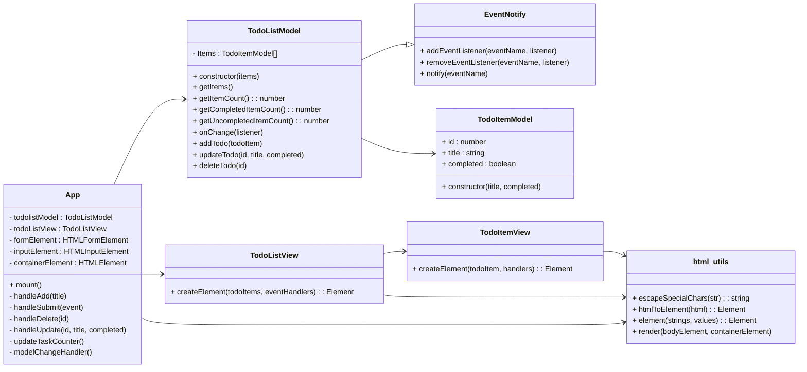
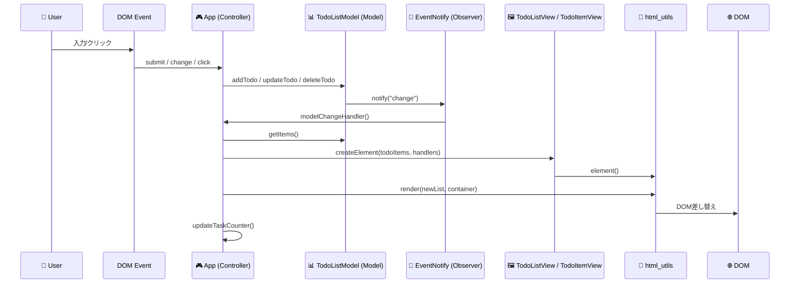
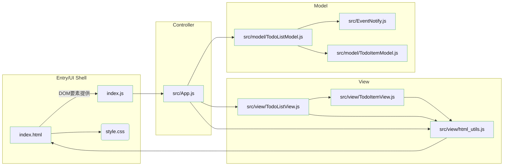
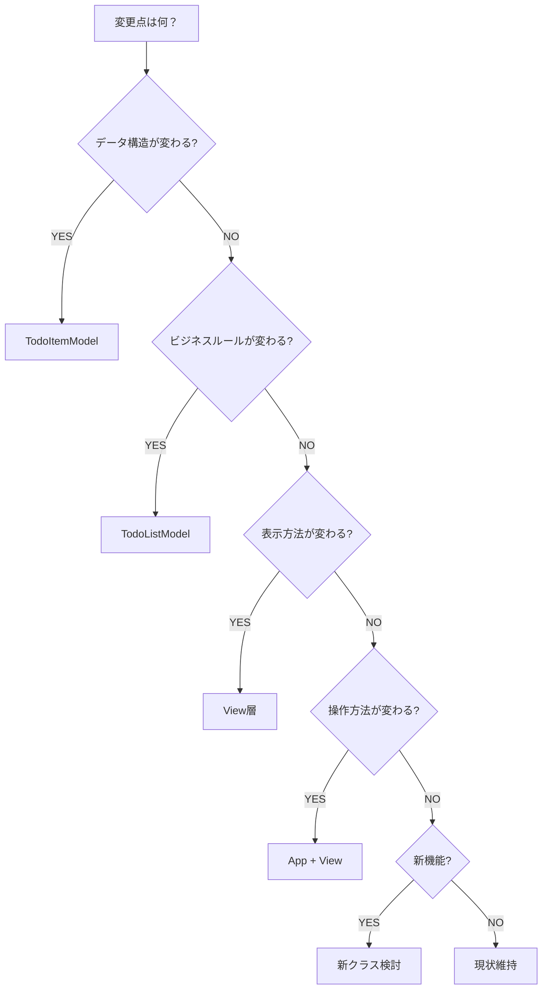

# 🏗️ js\_todo：Observerパターン実装まとめ

## 1) レイヤーアーキテクチャ図

--- 

### クラス図

---

## 2) データフロー（イベント→モデル→通知→ビュー更新）

---

## 3) ファイル責務マップ（どのファイルが何を担当？）

### 各ファイルの役割と主な処理

* **`index.html`**

  * 画面の骨組み（フォーム、入力、リスト、フッター）を提供
  * `id="js-form"`, `id="js-form-input"`, `id="js-todo-list"`, `id="js-todo-count"` を **JSが取得**して使う
* **`style.css`**

  * 見た目の定義（フォーム、リスト、ホバー、レスポンシブ）
  * `.todo-item`, `.checkbox`, `.todo-text`, `.edit/.delete/.save/.cancel` などのスタイル
* **`index.js`**

  * `new App()` を作成し、`window.load` で `app.mount()` 実行
* **`src/App.js`（Controller）**

  * DOMイベントを受けて、**Modelに処理を委譲**
  * **Modelの変更通知**を購読して **Viewを再描画**
  * 追加（`#handleAdd`）／更新（`#handleUpdate`）／削除（`#handleDelete`）の**ハンドラ**を持つ
  * `#modelChangeHandler` で `TodoListView.createElement()` → `render()` 差し替え → カウンター更新
* **`src/model/TodoListModel.js`（Model + Observer継承）**

  * `EventNotify` を継承、**状態管理**と **変更通知（notify("change")）** を担う
  * `#Items`に`TodoItemModel`配列を保持、`add/update/delete`で状態変更
  * `onChange(listener)` でリスナ登録（App側が登録）
* **`src/model/TodoItemModel.js`（Entity）**

  * 1件のTodoを表現（`id`, `title`, `completed`）
  * コンストラクタでID採番
* **`src/EventNotify.js`（Observer基盤）**

  * `addEventListener/removeEventListener/notify` を提供（Modelが継承して利用）
* **`src/view/TodoListView.js`（View：リスト）**

  * `createElement(todoItems, handlers)` で `ul` を作成し、各アイテムを `TodoItemView` に委譲
* **`src/view/TodoItemView.js`（View：項目）**

  * `createElement(todoItem, {onUpdateTodo, onDeleteTodo})`
  * チェックボックス（完了/未完了）、編集/保存/キャンセル、削除ボタンの**UIとイベント**
* **`src/view/html_utils.js`（Utility）**

  * `element`（タグ付きテンプレート）で **XSS対策付き**のDOM生成
  * `render` で **コンテナの中身を差し替え**（再描画の要）

---

## 4) コードに即した補足説明（必要な処理・注意点）

### (A) Controller ↔ Model ↔ View の結線

* `App.mount()` で

  1. **Modelの変更通知**を購読：`todolistModel.onChange(this.#modelChangeHandler)`
  2. **フォーム送信**イベントを購読：`form.addEventListener("submit", this.#handleSubmit)`
* 追加・更新・削除の各ハンドラは **Modelメソッド** (`addTodo/updateTodo/deleteTodo`) を呼ぶだけに徹し、**ビジネスロジックはModel側**に集約。
* Modelは状態変化のたびに `notify("change")`。それを受けた `#modelChangeHandler()` が **Viewを再構築→renderで差し替え**→**タスク数更新** の順に処理。

### (B) Viewの安全なDOM生成

* `html_utils.element` は **文字列値だけエスケープ**するため、XSSリスクを軽減。テンプレート上で外部入力を埋め込むのに適切。
* 再描画は `render(newList, container)` の**丸ごと差し替え**で実装シンプルに。

### (C) 編集UIのふるまい（改善ポイント付き）

* `TodoItemView` の「編集」「保存」「キャンセル」を切り替えて表示。
* **改善提案**：キャンセル時は編集UIを閉じて元の値に戻すだけにし、`onUpdateTodo` を呼ばない方が直感的（現在は呼んで元の値を再適用している）。

### (D) 進捗カウンターの命名整合

* `App.#updateTaskCounter()` 側で呼んでいる集計メソッド名と、Modelの実装名に**差異**があるとバグの温床に。

  * **推奨統一名（Model）**：`getItemCount()` / `getCompletedItemCount()` / `getUncompletedItemCount()`
  * **App側も同名に合わせる**のが安全。

---

## 5) 典型ユースケース別の変更指針

### 5-1) データ構造の追加（例：優先度 priority）

* 変更：`TodoItemModel` に `priority` 追加
* 表示：`TodoItemView` に表示/編集UIを追加
* ロジック（任意）：`TodoListModel` にソートやフィルタを追加
* Controller：入力値の受け渡し・検証を追加

### 5-2) 表示機能の追加（例：カレンダー表示）

* 新View `TodoCalendarView` を追加し、`App` が表示切替を管理
* Model/Entity は既存のままでもOK（表示のみ拡張）

### 5-3) ビジネスロジックの追加（例：期限切れ警告）

* `TodoItemModel` に `deadline` 追加
* `TodoListModel` に期限チェック・警告判定
* `TodoItemView` が期限切れ表現（色/バッジ）
* `App` はトリガー＆UI反映

---

## 6) 「どのクラスを変更すべき？」チェックリスト

## 7) まとめ

* \*\*イベントはController（App）\*\*が受け、**Modelに依頼** → **ModelがObserverで通知** → **AppがViewを再描画**。
* **表示はView、状態はModel、橋渡しはApp**に厳密分離。
* 再描画は `render()` の全差し替えでシンプル＆安全。
* ユニット変更も「どこを触るか」が明確で、拡張しやすい構造です。

---

### おまけ（思考トレーニング）

\*\*「ドラッグ&ドロップで並び替え」\*\*を入れるなら：

* 表示側：`TodoListView/TodoItemView` に DnD ハンドラ
* データ側：`TodoListModel` に `reorder(fromIndex, toIndex)`
* App：DnDの結果を受けて `reorder` を実行 → `notify("change")` → 再描画

---
